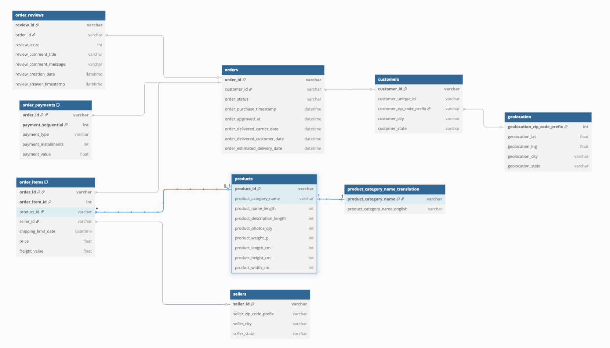

<<<<<<< HEAD
# DSAI Module 2 Final Project

## Deliverables

[Github Repository](https://github.com/yeesoontuck/module2-project)

[Jupyter Notebook](notebooks/project.ipynb)

[Report Slide Deck](assets/slides.pdf)

---

## Data 

[Brazilian E-Commerce Public Dataset by Olist](https://www.kaggle.com/datasets/olistbr/brazilian-ecommerce)



---
=======
# 🛒 Brazilian E-Commerce dbt Project (BigQuery)

This project builds a modern analytics pipeline using **dbt**, **Google BigQuery**, and **Jupyter Notebooks** to transform and analyze the [Brazilian E-Commerce dataset](https://www.kaggle.com/datasets/olistbr/brazilian-ecommerce).

---

## 📁 Project Structure

```
brazilian_ecommerce_dbt/
├── dbt_project.yml
├── models/
│   ├── staging/
│   │   ├── stg_orders.sql
│   │   ├── stg_customers.sql
│   │   └── ...
│   ├── marts/
│   │   ├── dim_customer.sql
│   │   ├── dim_product.sql
│   │   ├── dim_seller.sql
│   │   ├── dim_date.sql
│   │   └── fact_orders.sql
│   └── analysis/
│       ├── avg_order_value_by_state.sql
│       ├── monthly_revenue_trend.sql
│       └── ...
```

---

## 🚀 Getting Started

### 1. 📦 Set up your environment

```bash
conda env create -f environment.yml
conda activate elt
```

Install dbt dependencies:
```bash
pip install dbt-bigquery google-cloud-bigquery pandas
```

### 2. 🔐 Authenticate to GCP

```bash
gcloud auth application-default login
```

### 3. 🏗️ Run dbt

```bash
dbt debug       # Test connection
dbt run         # Build models
dbt test        # Run data quality tests
dbt docs serve  # Launch documentation site
```

---

## 🧱 Models Overview

| Model           | Type     | Description                                      |
|------------------|----------|--------------------------------------------------|
| `stg_*`          | Staging  | Cleans and renames raw source tables            |
| `dim_customer`   | Dimension | Customer info (city, state)                     |
| `dim_product`    | Dimension | Product attributes (category, weight, etc.)     |
| `dim_seller`     | Dimension | Seller city/state info                          |
| `dim_date`       | Dimension | Calendar table from order timestamps            |
| `fact_orders`    | Fact      | Revenue, item-level sales by order              |

---

## 🧪 Data Quality Tests

- `not_null`, `unique` checks on keys
- Logical constraints:
  - `order_estimated_delivery_date >= order_purchase_timestamp`
  - `order_status` accepted values test

---

## 📈 Exploratory Analysis

Use the companion Jupyter notebook to visualize:

- 📊 Monthly revenue trend
- 🚚 Average delivery delay by state
- 🛍️ Top product categories by price
- 🛒 Top sellers by revenue
- ❌ Cancel rate by customer state

---

## 📎 Requirements

- Python 3.10+
- dbt-bigquery
- Google Cloud SDK
- BigQuery dataset: `brazilian_ecommerce`
- Project ID: `Data Engineering Project`

---

## 🤝 Authors & License

- Built as part of the NTU Advanced Data Engineering Capstone
- Open-source and extensible

>>>>>>> ac1e2ed (Add dbt models and config for BigQuery pipeline)
